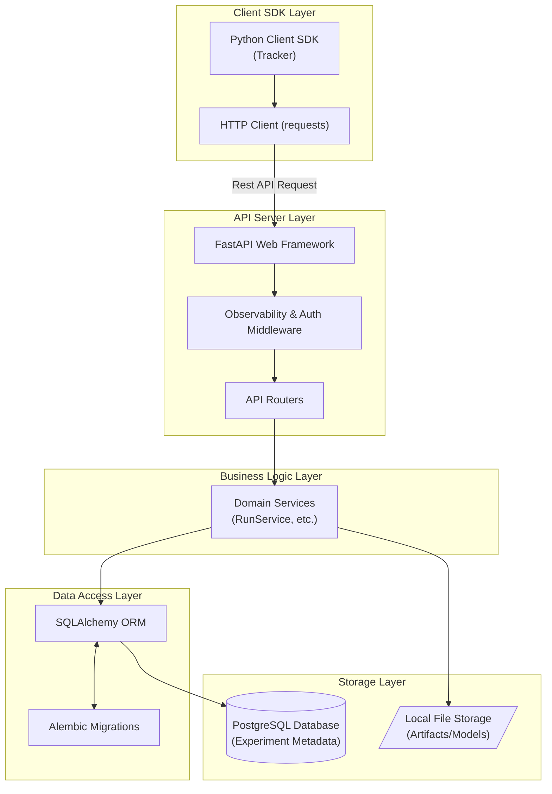

# Mini-MLflow

Mini-MLflow is a lightweight, high-performance system for tracking Machine Learning experiments. Built with modern Python frameworks, it provides an API-first approach to logging parameters, metrics, run data, and artifacts.

## Why does this exist?

While MLflow is an industry standard, it can sometimes be too heavyweight or complex for small-to-medium sized projects. Mini-MLflow was created to serve as a streamlined, faster, and more modern alternative. It aims to provide exactly the core features you need to track machine learning experiments without the overhead, making it ideal for fast-paced development cycles, local deployments, and constrained environments.

## How is it different from MLflow?

- **Modern Tech Stack:** Built from the ground up using **FastAPI** (instead of Flask) and **Pydantic**, enabling asynchronous request handling, built-in validation, and auto-generated Swagger UI documentation out-of-the-box.
- **Minimal Dependencies:** Stripped of heavy components (such as Spark dependencies or complex UI bundles), keeping the footprint extremely lightweight and installation fast.
- **Simpler Architecture:** Focuses purely on tracking. It avoids the complexities of integrated model registries or deployment orchestration, ensuring lower resource consumption.
- **Built-in Security & Observability:** Natively includes API Key authentication and observability middleware to monitor incoming requests and ensure security.
- **Developer First:** Extremely easy to set up using Docker Compose and simpler to mock for integration tests using the native pytest framework.

## Architecture Diagram

The system employs a standard Client-Server architecture separated into clear layers:



## Features

- **Experiment Tracking:** Create and manage distinct experiments for different machine learning tasks.
- **Run Management:** Log specific runs under an experiment, encapsulating parameters, tags, and execution status.
- **Parameter & Metric Logging:** High-performance logging of dynamic parameters and model evaluation metrics over time.
- **Artifact Storage:** Save and retrieve model artifacts securely to the local filesystem or configured volumes.
- **Secure by Default:** Integrates API key authentication for production-ready deployments.
- **Robust Testing:** Highly tested backend system ensuring stability and regression prevention.

## Quickstart

### Running the Server

Start the tracking server locally using Docker Compose:
```bash
docker-compose up -d
```
Alternatively, run the server natively using `uvicorn` (requires a configured PostgreSQL connection string in the environment):
```bash
python -m uvicorn mini_mlflow.server.main:app --reload --host 127.0.0.1 --port 8000
```
Visit `http://127.0.0.1:8000/docs` to view the interactive API documentation.

### Tracking an Experiment

Install the local package and start tracking using the included Python client:

```python
from mini_mlflow.client.tracking import Tracker

# Initialize Tracker pointing to your running server
tracker = Tracker(server_uri="http://127.0.0.1:8000")

# Create an Experiment and start a Run
exp = tracker.create_experiment(name="Housing Prices")
run = tracker.start_run(experiment_id=exp.experiment_id, run_name="Baseline Model")

# Log parameters and metrics
tracker.log_param(run.run_id, "algorithm", "RandomForest")
tracker.log_metric(run.run_id, "rmse", 0.42)

# Finish the Run
tracker.end_run(run.run_id)
print("Run completed securely and efficiently!")
```

## Testing

To verify the installation and system health, run the automated test suite using `pytest`:
```bash
python -m pytest --cov=mini_mlflow
```

### End-to-End Testing

To run the end-to-end testing baseline that validates full workflows (like Housing Price Regression and Sentiment Classification), use:
```bash
python -m pytest tests/e2e -v
```

## End-to-End Examples

Mini-MLflow provides ready-to-use E2E examples showcasing how to integrate with real machine learning datasets and models. Check out the `examples/` directory for scripts including:
- **Housing Price Regression**: Demonstrates tracking a custom tabular regression model.
- **Sentiment Classification**: Demonstrates tracking a binary text classification model.

To run an example locally against a running server:
```bash
python examples/housing_regression.py
```
